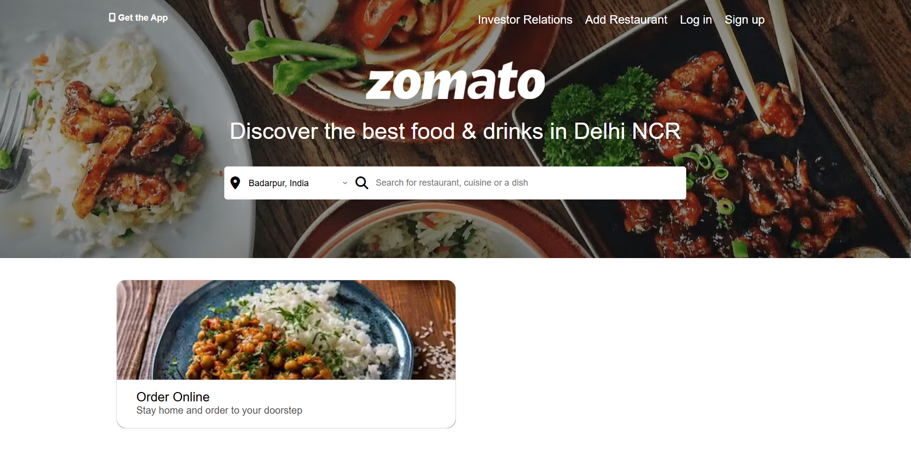

# 🍽️ Zomato Clone (HTML & CSS)

A visually appealing and responsive **Zomato homepage clone** built entirely with **HTML and CSS**. This project was created to enhance frontend development skills through real-world UI replication and layout design.



---

## 🌟 Features

- 🧭 Navigation bar with logo and search bar
- 📍 Location & restaurant search input
- 📸 Hero section with background image
- 🍕 Popular food categories
- 🧾 Footer with links and social icons
- 💻 Fully responsive design for mobile and desktop

---

## 🔧 Technologies Used

- **HTML5** – For structuring the webpage
- **CSS3** – For styling and responsive design

> 🚫 No JavaScript or frameworks used — just pure HTML and CSS.

---

## 🗂️ Project Structure

zomato-clone/
│
├── index.html 
├── style.css 
├── images/ 
└── README.md 

---

## 🧠 What I Learned

- Structuring complex layouts with HTML
- Creating responsive designs using media queries
- Styling modern UI components with CSS
- Improving attention to detail by replicating real-world UI

---

## 🚀 Getting Started

1. **Clone the repository**:
    ```bash
      git clone https://github.com/aryandas2911/Zomato-Clone.git
2. Open index.html in your preferred browser

---

## 🔮 Future Enhancements

Add interactive elements with JavaScript

Build login/signup functionality

Fetch live restaurant data from an API

---

## 🙌 Acknowledgements
Inspired by the official Zomato homepage.


